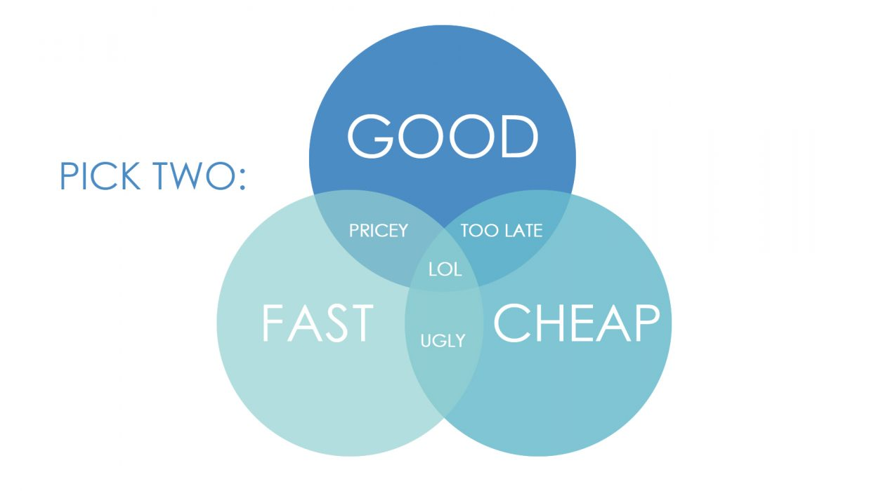

# Utilizing Yelp Cost Estimates for Estimating Neighborhood Affluency
Authors:  

[Jamie McElhiney](https://github.com/jmce619)  
[Freda Xin](https://github.com/FredaXin)  
[Julie B](https://github.com/juliebga) 
___
## Problem Statement
Using Yelp data, our client wants to estimate the affluence of a neighborhood based on the types of businesses within it. Specifically, they would like us to utilize the prices ($, $$, $$$, $$$) and business categories available within Yelp. For context, traditional methods for estimating wealth are based on demographic characteristics (e.g. income or unemployment rate). The novelty of this approach is to use crowdsourced data related to commercial activity and cost of product/services as an indicator for affluency.

___
## Executive Summary

During the data collection process, we used [Yelp Fusion
API](https://www.yelp.com/developers/documentation/v3/get_started) and collected
30,293 Yelp business information in NYC. To measure neighborhoods
afflunency, we used property values, i.e. home prices, and collected data from
the [NYC department of Finance Rolling Sales Data](https://www1.nyc.gov/site/finance/taxes/property-rolling-sales-data.page). This approach makes
intuitive sense, since a neighborhood's property can reveal how affluent the
residents are in that area. In addition, this approach is capable of incorporating
the most up to date real estate information (since NYC Department of Finance
generates data on a rolling basis for the past 12 months); this is an
advantage comparing to the past approaches of using IRS tax return
(which can be out of date and does not offer the current affluency status of a neighborhood).

For our project, we chose NYC as a case study to develop our models: NYC has
a high density of population, high concentration of businesses on Yelp, and high
diversity of types of businesses and neighborhoods, which are desirable when
training models; We also envisioned to generalize our models and to make it
transferrable to other urban areas in the U.S. We took the initial steps toward this
direction in our modeling phase. 

During the EDA process, we investigated Yelp's **$ rating** and found that the
most frequent ratings are $$ for NYC. We further broke this down into the 5
boroughs and found that $ rating are the most common price ratings for Queens,
Brooklyn, and Bronx; whereas $$ signs are the most common price rating for
Manhattan and Staten Island. The fact that Staten Island has a very high percentage
of $$ rating led us to rethink our assumption: is Yelp's $ rating a good
predictor for a neighborhood's affluency status? We then investigated other
features from Yelp's business listings, and found that (business)
**categories** yielded far more illuminating insights about a neighborhood's
affluency status. The features derived from the categories proved to be very
predictive in our models. In addition, we used K-means to generate 80 clusters based on
latitudes and longitudes: those clusters defined our **'neighborhood'**.  

As we stepped into the modeling phase, we developed two different approaches:
first, we used the clusters to generate aggregated data for each cluster and
developed 4 types of classification models: Logistic Regression, KNN,
Tree based models, and PCA. This approach has the advantage of high interpretability since
each observation represents the overall characteristics of the businesses in a given
neighborhood. In addition, this approach was our initial step of generalizing the
models that will be applicable for all urban areas in the U.S.. For the second
approach, we used all individual Yelp businesses as observations (about 20k) and
developed 4 types of classification models: Logistic Regression, KNN, Tree based
models, and Voting Classifier. In short, the first approach is a good and cheap
approach, while the second is fast and cheap. We will use **AUC ROC** as the metric
to eveluate the performance of our models.

 
 [Image source](https://www.dancker.com/blog/good-fast-cheap/)

___
## Data Dictionary: Yelp

| Name | Data Types (Pandas) | Description |
|---|---|---|
|id|object|a unique ID for each business, e.g. E8RJkjfdcwgtyoPMjQ_Olg|
|alias |object|business name alias| 
|name|object|business name|
|image_url|object|URL of photos taken at a given business|
|is_closed|bool|True if the business is currently open, else False|
|url|object|url of business listing on Yelp|
|review_count|int64|Number of reviews|
|categories|object|List of category title and alias pairs associated with this business|
|rating|float64|Rating for this business (value ranges from 1, 1.5, ... 4.5, 5)|
|coordinates|object|Coordinates of this business|
|transactions|object|List of Yelp transactions that the business is registered for, such as pickup, delivery and restaurant_reservation.|
|price|object|Price level of the business. Value is one of \\$, \\$\\$, \\$\\$\\$ and \\$\\$\\$\\$.|
|location|object|Location of this business, including address, city, state, zip code and country.|
|phone|object|phone number of the business|
|display_phone|object|Phone number of the business formatted nicely to be displayed to users. The format is the standard phone number format for the business's country.|
|distance|float64|Distance in meters from the search location. This returns meters regardless of the locale.|

___
## Conclusion
For **modeling option 1**,  the Logistic Regression model outperformed the
others. We also explored Principal Component Analysis as a modeling option
for our cluster dataset and uncover interesting business associations that are
predictors of affluent neighborhoods.

Via Logistic Regression, we discovered numerous business types that are predictive of affluence in our NYC-based areas. The top predictors of affluence were french restaurants, cocktail bars and ramen shops. Cafes and Coffee shops also had a strong presence, along with wine and beer bars. This is intuitively sensible, as these types of business would typically be frequented by people with extra expendable income. People who are more affluent would be more able to sustain upscale alcohol establishments (cocktail and wine bars) and cafes.

We also discovered business types that are predictive of the negative class ('not affluent'). The top predictors of 'not affluent' areas are the fraction of pizza restaurants, hot dog shops, donut shops & 1-dollar sign businesses in general. This is intuitively sensible as these types of businesses provide quick and inexpensive food and product options.
___
For **modeling option 2**,  the Voting Classifier outperformed the other modeling methods. The
Logistic Regression model was the second best performing model. Since the later
is very interpretable, we explained the features based on the coefficient.

For this modeling option, surprisingly, **review_count** is the strongest predictor for the positive class. The potential reason might be: More review counts indicate higher volumes of costumers, which means the location might have a higher density of population and/or higher traffic.
___
**Overall findings**: 
- We have been successful in predicting affluence, based on the percentages of business types and prices within an area.
- We found that key business types are clearly associated with and predictive of a neighborhood’s affluence
- When assessing an individual business (i.e., whether it’s in an affluent neighborhood) – the review counts and rating improve the predictions.
- Option 1 is our first step towards generalization - in the future, we will expand this method by transferring this approach to other urban areas.

___

## References
- [Github Link for DSI-NYC (2) students' past
work.](https://github.com/Shaddyjr/predicting_affluence_using_yelp)

- [Github Link for DSI-LA students' past
work.](https://github.com/hovikgas/hovieco)
